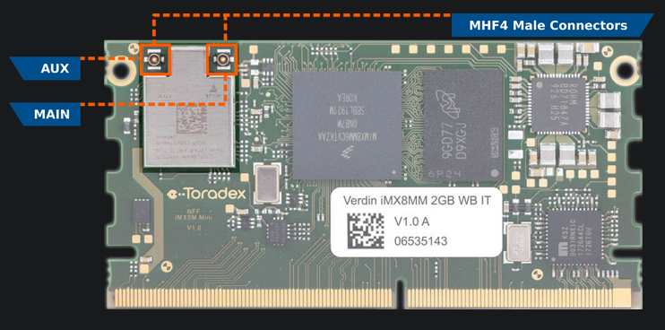

## Bluetooth:

## Prerequisites:

1. A SoM with [TorizonCore](https://developer.toradex.com/torizon) installed

2. Already completed the [Quickstart Guide - Toradex](https://developer-archives.toradex.com/getting-started)

3. Knowledge of [Device Tree Overlay on Torizon](https://developer.toradex.com/torizon/os-customization/use-cases/device-tree-overlays-on-torizon).

## Changing Device-Tree:

#### Getting Source Code:

To get the source code of the Toradex-supplied device tree files (including overlays), you need to clone two repositories:

- **Linux kernel**:
   it contains the device trees and headers that both device trees and 
  overlays might reference. For i.MX 6/6ULL/7, we use the upstream kernel 
  directly from kernel.org, and for i.MX 8/8X/8M Mini/8M Plus we provide 
  our own fork based on the NXP downstream kernel.
- **Device tree overlays**:
   this is a repository with overlays provided by Toradex. You need to use
   a specific branch and commit depending on the TorizonCore version and 
  whether it uses the upstream kernel or our fork based on the NXP 
  downstream.

##### Info:

The device trees and overlays workflow is being reviewed. The `torizoncore-builder dt checkout` command is not available for TorizonCore 6 at the moment, and it may 
change or be deprecated. For TorizonCore 5, go to the corresponding 
version docs.

###### Not available for TorizonCore 6

```bash
$ torizoncore-builder dt checkout 
```

###### Torizoncore version above 6 :

###### Cloning the `linux` or `linux-toradex` repositories may take a while.

For i.MX 6/6ULL/7 :

```bash
git clone -b linux-6.0.y git://git.kernel.org/pub/scm/linux/kernel/git/stable/linux.git
```

```bash
git clone -b master git://git.toradex.com/device-tree-overlays.git device-trees
```

For i.MX 8/8X/8M Mini/8M Plus:

```bash
git clone -b toradex_5.15-2.1.x-imx git://git.toradex.com/linux-toradex.git linux
```

```bash
git clone -b toradex_5.15-2.1.x-imx git://git.toradex.com/device-tree-overlays.git device-trees
```

You will end up with `linux` and `device-trees` directories.

To see the available device trees and select the appropriate one for your device, run the command below, passing the parameter `-name` accordingly to your device: 

 Verdin IMX8M Mini: 

```bash
find linux -name "*imx8mm-verdin*.dts"
```

Output: 

```bash
linux/arch/arm64/boot/dts/freescale/imx8mm-verdin-nonwifi-dev.dts
linux/arch/arm64/boot/dts/freescale/imx8mm-verdin-wifi-dahlia.dts
linux/arch/arm64/boot/dts/freescale/imx8mm-verdin-nonwifi-yavia.dts
linux/arch/arm64/boot/dts/freescale/imx8mm-verdin-wifi-dev.dts
linux/arch/arm64/boot/dts/freescale/imx8mm-verdin-wifi-yavia.dts
linux/arch/arm64/boot/dts/freescale/imx8mm-verdin-nonwifi-dahlia.dts
```

Verdin IMX8M Plus:

```bash
find linux -name "*imx8mp-verdin*.dts"
```

Output:

```bash
linux/arch/arm64/boot/dts/freescale/imx8mp-verdin-wifi-yavia.dts
linux/arch/arm64/boot/dts/freescale/imx8mp-verdin-nonwifi-dev.dts
linux/arch/arm64/boot/dts/freescale/imx8mp-verdin-nonwifi-yavia.dts
linux/arch/arm64/boot/dts/freescale/imx8mp-verdin-wifi-dahlia.dts
linux/arch/arm64/boot/dts/freescale/imx8mp-verdin-nonwifi-dahlia.dts
linux/arch/arm64/boot/dts/freescale/imx8mp-verdin-wifi-dev.dts
```

##### Changing Device-tree for  the Verdin IMX8M Mini:

```bash
torizoncore-builder dt apply --include-dir linux/include --include-dir linux/arch/arm64/boot/dts/freescale/ linux/arch/arm64/boot/dts/freescale/imx8mm-verdin-wifi-dahlia.dts
```

##### Changing Device-tree for  the Verdin IMX8M Plus:

```bash
torizoncore-builder dt apply --include-dir linux/include --include-dir linux/arch/arm64/boot/dts/freescale/ linux/arch/arm64/boot/dts/freescale/imx8mp-verdin-wifi-dahlia.dts
```

#### Create a Branch:

```bash
$ torizoncore-builder union custom-branch
```

#### Deploying The Image:

Directly on the board through [SSH](https://developer.toradex.com/software/development-resources/ssh), with the `deploy` command, passing the device IP address, username, and password as arguments:

```bash
torizoncore-builder deploy --remote-host <ip or host> --remote-username torizon --remote-password torizon --reboot custom-branch
```

## Operating Toradex Wi-Fi/BT Capable Modules Using Dual and Single Antenna Configurations

#### Use Cases:

Toradex SoMs with Wi-Fi/BT enabled support dual and single antenna  configurations. Dual antenna operation is recommended and is the default configuration to obtain maximum throughput and stability performance through the usage of Multiple-Input Multiple-Output (MIMO).

In case Bluetooth is needed, its signal is only available on the AUX terminal. Further, if you plan to use only Bluetooth, you will probably not have additional benefits from using two antennas.

Scenarios of antenna usage:

- Dual Antenna (best performance - Wi-Fi and Bluetooth available, Antennas plugged into both AUX and MAIN connectors).
- Single Antenna (only Wi-Fi available, Antenna plugged into the MAIN connector).
- Single Antenna (Wi-Fi and Bluetooth available, Antenna plugged into the AUX connector).

The MHF4 connectors are located at the Wi-Fi/BT chipset. The image below brings an example in a Verdin iMX8MM:



## Bluetoothctl:

#### Enable Service:

Verify if the bluetooth.service is enabled: 

```bash
systemctl status bluetooth.service
```

If don't, enable with this command: 

```bash
sudo systemctl enable bluetooth
```

```bash
sudo systemctl start bluetooth.service
```

#### Unblocking Bluetooth:

Verify if Bluetooth isn't in hardware or software blocked mode with this command: 

```bash
rfkill list
```

Possible Output: 

```bash
0: phy0: Wireless LAN
        Soft blocked: yes
        Hard blocked: no
1: hci0: Bluetooth
        Soft blocked: yes
        Hard blocked: no
```

If there is in Soft blocked mode, unblocked with this command: 

```bash
sudo rfkill unblock <ID> #in that case 1
```

or 

```bash
sudo rfkill unblock bluetooth 
```

#### Power on Bluetooth:

You also need to power on Bluetooth with this command: 

```bash
bluetoothctl power on
```

#### Scanning for Nearby Devices

To search for Bluetooth devices that you can connect to, use the **scan** command:

```bash
bluetoothctl scan on
```

#### To connect to a specific device:

Now that you have a list of Bluetooth devices you can connect to, use the MAC address to connect to a particular device.

```bash
bluetoothctl pair <Bluetooth_Address>
```

For devices that are already paired with your board, you can simply connect to them in the future using the **connect** command as follows:

```bash
bluetoothctl connect <Bluetooth_Address>
```

#### Others usefully commands:

To make your Bluetooth adapter discoverable to other devices, use the following command:

```bash
bluetoothctl discoverable on
```

You can look at the devices that are currently paired with your system by running the following command:

```bash
bluetoothctl paired-devices
```

To trust certain devices so that you easily connect to them in the future:

```bash
bluetoothctl trust <Bluetooth_Address>
```

To unpair a Bluetooth device: 

```bash
bluetoothctl disconnect <Bluetooth_Address>
```

Using the Interactive Mode:

```bash
bluetoothctl
```

## References:

1. https://developer.toradex.com/linux-bsp/application-development/networking-connectivity/bluetooth-linux/

2. https://developer.toradex.com/software/connectivity/bluetooth-on-toradex-computer-on-modules/

3. https://developer.toradex.com/software/connectivity/operating-toradex-wi-fibt-capable-modules-using-single-antenna-configuration/

4. [How to Manage Bluetooth Devices on Linux Using bluetoothctl](https://www.makeuseof.com/manage-bluetooth-linux-with-bluetoothctl/)

5. https://developer.toradex.com/torizon/os-customization/use-cases/device-tree-overlays-on-torizon/

6. https://developer.toradex.com/linux-bsp/os-development/build-yocto/device-tree-overlays-linux/
