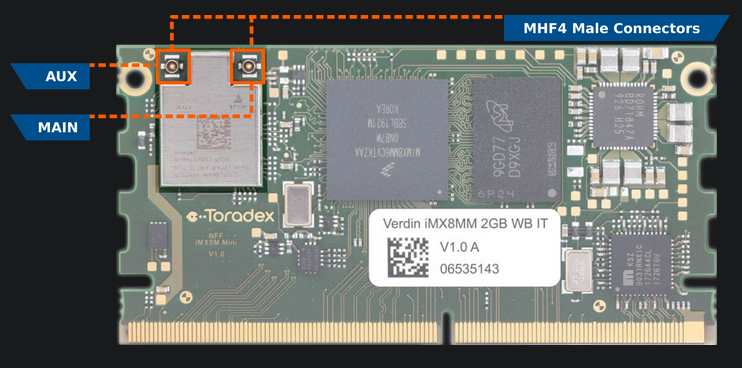

## Wi-Fi:

## Prerequisites:

1. A SoM with [TorizonCore](https://developer.toradex.com/torizon) installed.

2. Have already completed [Quickstart Guide - Toradex](https://developer-archives.toradex.com/getting-started).

3. Knowledge of [Device Tree Overlay on Torizon](https://developer.toradex.com/torizon/os-customization/use-cases/device-tree-overlays-on-torizon).

## Changing Device-Tree:

#### Getting Source Code:

To get the source code of the Toradex-supplied device tree files (including overlays), you need to clone two repositories:

- **Linux kernel**:
   it contains the device trees and headers that both device trees and 
  overlays might reference. For i.MX 6/6ULL/7, we use the upstream kernel 
  directly from kernel.org, and for i.MX 8/8X/8M Mini/8M Plus we provide 
  our own fork based on the NXP downstream kernel.
- **Device tree overlays**:
   this is a repository with overlays provided by Toradex. You need to use
   a specific branch and commit depending on the TorizonCore version and 
  whether it uses the upstream kernel or our fork based on the NXP 
  downstream.

##### Info:

The device trees and overlays workflow is being reviewed. The `torizoncore-builder dt checkout` command is not available for TorizonCore 6 at the moment, and it may 
change or be deprecated. For TorizonCore 5, go to the corresponding 
version docs.

###### Not available for TorizonCore 6

```bash
$ torizoncore-builder dt checkout 
```

###### Torizoncore version above 6 :

###### Cloning the `linux` or `linux-toradex` repositories may take a while.

For i.MX 6/6ULL/7 :

```bash
git clone -b linux-6.0.y git://git.kernel.org/pub/scm/linux/kernel/git/stable/linux.git
```

```bash
git clone -b master git://git.toradex.com/device-tree-overlays.git device-trees
```

For i.MX 8/8X/8M Mini/8M Plus:

```bash
git clone -b toradex_5.15-2.1.x-imx git://git.toradex.com/linux-toradex.git linux
```

```bash
git clone -b toradex_5.15-2.1.x-imx git://git.toradex.com/device-tree-overlays.git device-trees
```

You will end up with `linux` and `device-trees` directories.

To see the available device trees and select the appropriate one for your device, run the command below, passing the parameter `-name` accordingly to your device: 

Verdin IMX8M Mini: 

```bash
find linux -name "*imx8mm-verdin*.dts"
```

Output: 

```bash
linux/arch/arm64/boot/dts/freescale/imx8mm-verdin-nonwifi-dev.dts
linux/arch/arm64/boot/dts/freescale/imx8mm-verdin-wifi-dahlia.dts
linux/arch/arm64/boot/dts/freescale/imx8mm-verdin-nonwifi-yavia.dts
linux/arch/arm64/boot/dts/freescale/imx8mm-verdin-wifi-dev.dts
linux/arch/arm64/boot/dts/freescale/imx8mm-verdin-wifi-yavia.dts
linux/arch/arm64/boot/dts/freescale/imx8mm-verdin-nonwifi-dahlia.dts
```

Verdin IMX8M Plus:

```bash
find linux -name "*imx8mp-verdin*.dts"
```

Output:

```bash
linux/arch/arm64/boot/dts/freescale/imx8mp-verdin-wifi-yavia.dts
linux/arch/arm64/boot/dts/freescale/imx8mp-verdin-nonwifi-dev.dts
linux/arch/arm64/boot/dts/freescale/imx8mp-verdin-nonwifi-yavia.dts
linux/arch/arm64/boot/dts/freescale/imx8mp-verdin-wifi-dahlia.dts
linux/arch/arm64/boot/dts/freescale/imx8mp-verdin-nonwifi-dahlia.dts
linux/arch/arm64/boot/dts/freescale/imx8mp-verdin-wifi-dev.dts
```

##### Changing Device-tree for  Verdin IMX8M Mini:

```bash
torizoncore-builder dt apply --include-dir linux/include --include-dir linux/arch/arm64/boot/dts/freescale/ linux/arch/arm64/boot/dts/freescale/imx8mm-verdin-wifi-dahlia.dts
```

##### Changing Device-tree for  Verdin IMX8M Plus:

```bash
torizoncore-builder dt apply --include-dir linux/include --include-dir linux/arch/arm64/boot/dts/freescale/ linux/arch/arm64/boot/dts/freescale/imx8mp-verdin-wifi-dahlia.dts
```

#### Create a Branch:

```bash
$ torizoncore-builder union custom-branch
```

#### Deploying The Image:

Directly on the board through [SSH](https://developer.toradex.com/software/development-resources/ssh), with the `deploy` command, passing the device IP address, username, and password as arguments:

```bash
torizoncore-builder deploy --remote-host <ip or host> --remote-username torizon --remote-password torizon --reboot custom-branch
```

## Operating Toradex Wi-Fi/BT Capable Modules Using Dual and Single Antenna Configurations

#### Use Cases:

Toradex SoMs with Wi-Fi/BT enabled support dual and single antenna  configurations. Dual antenna operation is recommended and is the default configuration to obtain maximum throughput and stability performance through the usage of Multiple-Input Multiple-Output (MIMO).

In case Bluetooth is needed, its signal is only available on the AUX terminal. Further, if you plan to use only Bluetooth, you will probably not have additional benefits from using two antennas.

Scenarios of antenna usage:

- Dual Antenna (best performance - Wi-Fi and Bluetooth available, Antennas plugged into both AUX and MAIN connectors).
- Single Antenna (only Wi-Fi available, Antenna plugged into the MAIN connector).
- Single Antenna (Wi-Fi and Bluetooth available, Antenna plugged into the AUX connector).

The MHF4 connectors are located at the Wi-Fi/BT chipset. The image below brings an example in a Verdin iMX8MM:



## Connect to a Wi-Fi network:

#### Step 1: Enable Your Wi-Fi Device

The Wi-Fi card on your Linux PC can't connect to the internet unless it's enabled, to see the status of all your networks interfaces, use this command: 

```bash
nmcli dev status
```

If you're not sure whether your Wi-Fi device is enabled or not, you can check with this command:

```bash
nmcli radio wifi
```

If the output shows that the Wi-Fi is **disabled**, you can enable it with the following command:

```bash
nmcli radio wifi on
```

## Step 2: Scan for available Wi-Fi

Use this command: 

```bash
nmcli dev wifi list
```

## Step 3: Connect to Wi-Fi

With Wi-Fi enabled and your SSID identified, you're now ready to connect. You can connect to a Wi-Fi network using the following command: 

```bash
nmcli dev wifi connect <WIFI_NAME> -a
```

## Step 4 : Test

Test it with a ping:

```bash
ping gnu.org
```

## Others usefully commands:

If you're connected to one network, but want to use a different connection, you can disconnect by switching the connection to **down**.

```bash
nmcli con down <WIFI_NAME>
```

Or use :

```bash
nmcli dev disconnect <DEVICE>
```

To connect to another saved connection, simply pass the **up** option in the nmcli command:

```bash
nmcli con up <WIFI_NAME>
```

## References:

1. [Basic Wi-Fi Usage with Torizon](https://developer-archives.toradex.com/getting-started/module-1-unboxing-and-bring-up/basic-wi-fi-usage-with-torizon)

2. https://developer.toradex.com/software/connectivity/wi-fi-on-toradex-computer-on-modules/

3. https://developer.toradex.com/software/connectivity/operating-toradex-wi-fibt-capable-modules-using-single-antenna-configuration/

4. [How to Connect to Wi-Fi Through the Linux Terminal With Nmcli](https://www.makeuseof.com/connect-to-wifi-with-nmcli/)

5. https://developer.toradex.com/torizon/os-customization/use-cases/device-tree-overlays-on-torizon/

6. https://developer.toradex.com/linux-bsp/os-development/build-yocto/device-tree-overlays-linux/
